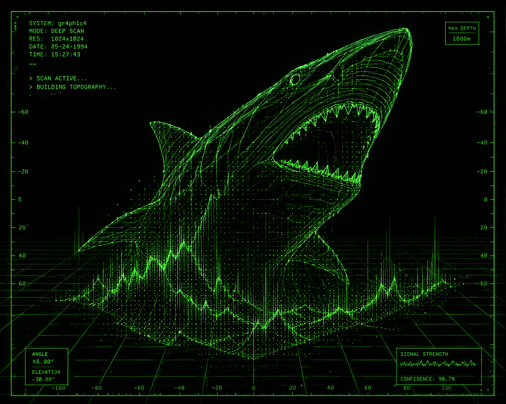

# Gr4ph1c4


<p align="center">
   
</p>

Gr4ph1c4 is a live visual command language. The long-term idea is to let a `.g4` command file describe visual screens that can become presentation-safe outputs.

This repository is **V0 PASS 1 only**. It intentionally implements one real vertical slice:

```text
.g4 input -> parser -> AST -> HTML/SVG renderer -> exported index.html -> smoke test inspection
```

## What PASS 1 supports

PASS 1 supports parsing and rendering one real `.g4` screen shaped like `examples/classroom-report.g4`:

- one `screen` with a name and title
- one `format:<projector>` setting
- one quoted `hero`
- one `chart` with bar-chart settings and data rows
- one quoted `note`

The renderer exports a real `index.html` containing stage-safe CSS and an SVG bars chart with visible labels.

## What is not implemented yet

No fake claims are made in this pass. These features are **not** implemented yet:

- no SQL yet
- no live editing yet
- no rollback yet
- no image points yet
- no plugin systems
- no V1 behavior

## Commands

Install dependencies once if needed:

```bash
npm install
```

Build:

```bash
npm run build
```

Run the smoke test:

```bash
npm run smoke
```

Run the built CLI directly:

```bash
node dist/main.js doctor
node dist/main.js parse examples/classroom-report.g4 --json
node dist/main.js render examples/classroom-report.g4 --out dist/site
```

## Errors

Parser and CLI failures use breadcrumb-style errors:

```text
error: GR4_E_...
where:
what:
why:
next:
```

`examples/bad-syntax.g4` is intentionally invalid and is checked by the smoke test to ensure this error shape is emitted.

## Sine Stream Control Demo

This demo uses a deterministic local sine-wave JSONL emitter.
It pipes records into Gr4ph1c4 through stdin.
Gr4ph1c4 keeps only the latest window of values.
Older values are discarded.
The demo renders the retained window as an inspectable SVG graph.
The browser controls reshape the visible graph.
Capture Moment writes the current state into an on-page JSON block.
It does not require InfluxDB.
It does not claim external telemetry ingestion yet.

Run:

```sh
node dist/main.js emit-sine-stream | node dist/main.js sine-demo --stdin --window 48 --out dist/sine-demo
```

Open:

```text
dist/sine-demo/index.html
```

## Chart.js Live Sine Demo

This demo uses a local Chart.js bundle.
It does not use a CDN.
It opens as a local browser file.
It shows a live sine wave that progresses over time.
Controls reshape the chart in real time.
Capture Moment writes the current state into an on-page JSON block.
It does not require InfluxDB, WebSockets, or a live server.

Generate the demo:

```bash
node dist/main.js chartjs-sine-demo
```

Open:

```text
dist/chartjs-sine-demo/index.html
```

## PASS 6 Three.js Ocean Points Demo

`three-ocean-points-demo` proves local Three.js access for a separate renderer capability proof.
It renders a deterministic animated 3D ocean point field from fixed x/z grid coordinates and wave math.
It runs locally from `dist/three-ocean-points-demo/index.html`; no server is required.
No real telemetry, database, or influx stream is used.
The Chart.js demo remains separate as `chartjs-sine-demo` and writes to `dist/chartjs-sine-demo/`.

Generate the demo:

```bash
node dist/main.js three-ocean-points-demo
```

Open:

```text
dist/three-ocean-points-demo/index.html
```
